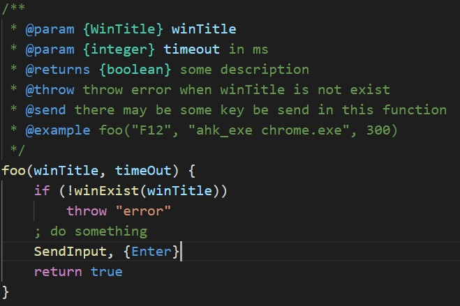
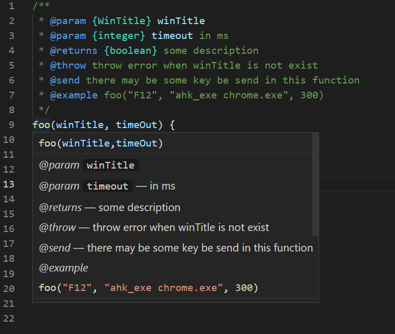
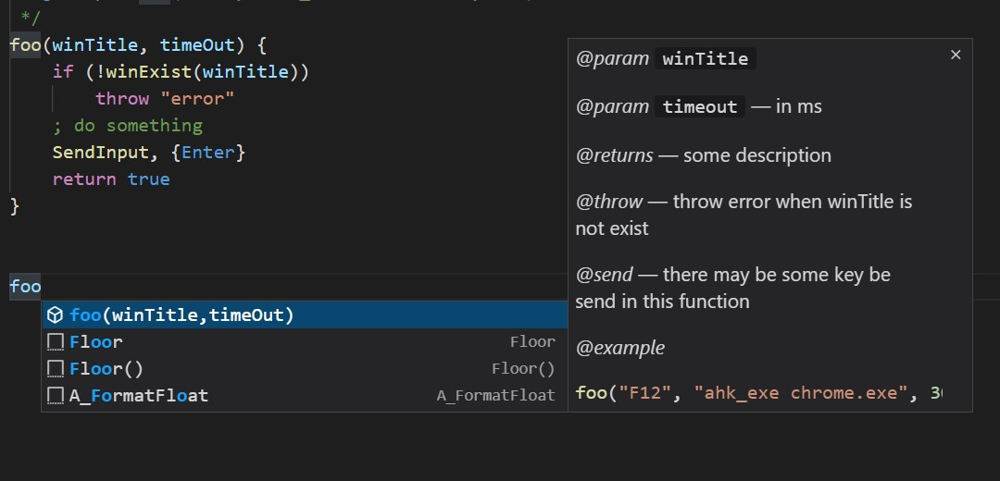
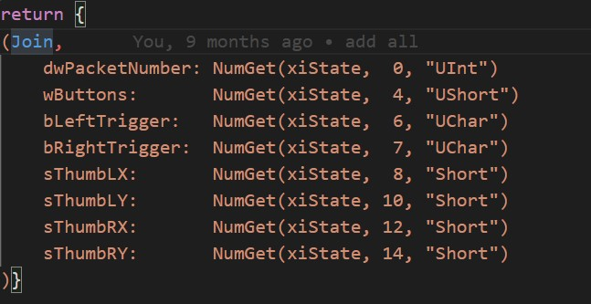
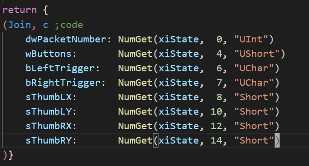

# AHKDoc
AHKDoc is a fork of [vscode-autohotkey-plus by cweijan](https://marketplace.visualstudio.com/items?itemName=cweijan.vscode-autohotkey-plus) with additional support for documentation called AHKdoc.

Ahkdoc is inspired by [JSDoc](https://jsdoc.app/index.html). 

This is an early version, and there is still a lot to be done.

Currently, it is very similar to jsdoc.

More functionality and better documentation will be coming in future version.

## Start

Install  [vscode-autohotkey-ahkdoc](https://marketplace.visualstudio.com/items?itemName=bhbbbbb.vscode-autohotkey-ahkdoc) from vscode marketplace.

---
## AHKDoc

- 

- 

- 

---
## String-Block

In ahk, string block can be start with several options, AhkDoc handle those options, making
it prettier.

- 

Sometime, we use this syntax for multi-line
coding (unfortunately, ahk doesn't support it).

Simply add a `;code` tag at the end of the line start with `(`.

Note that in order to make `;code` be parsed as comment, the `comment` option (namely, `comments`, `com`, `c`) should be included in this string block.

- 
---

## Setting

OpenSetting -> extensions -> Ahk Plus

---
## Versions
### v0.5.0
- add ahkdoc

### v0.5.1
- highlight byref
- fix bug that enter on the line with `/**`
- new tag `@byref`
- make string block prettier see [String-Block](#String-Block)

### v0.5.2
- fix bug caused by v0.5.1
- fix functionality working with `ByRef`

---

## Todo

- Variadic Functions
- [x] Join Ltrim ...
- [x] Hightlight ByRef
	- [x] byref support not in parser yet
- [ ] parse method's default value
- [ ] in `switch` default should be colored in same class as (`while if` ...)
- [x] new tag @byref
- [x] enter on the line with `/**`
- [ ] color const (all uppercase var)
- [ ] support for class
	- [ ] get and set highlight
	- [ ] `__New, __Get, __Call...` color fix (when '{' at the end of line)
	- [ ] meta function syntax
- [ ] @link @see
- [ ] @deprecated
- [ ] fix variable colored as keyword (when keyword == Key Name)
- [ ] object cannot have `,` at last prop

---
## Credits
- [vscode-autohotkey-plus by cweijan](https://marketplace.visualstudio.com/items?itemName=cweijan.vscode-autohotkey-plus)